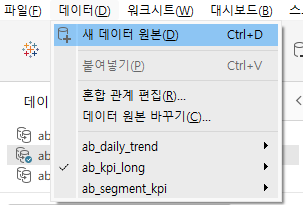
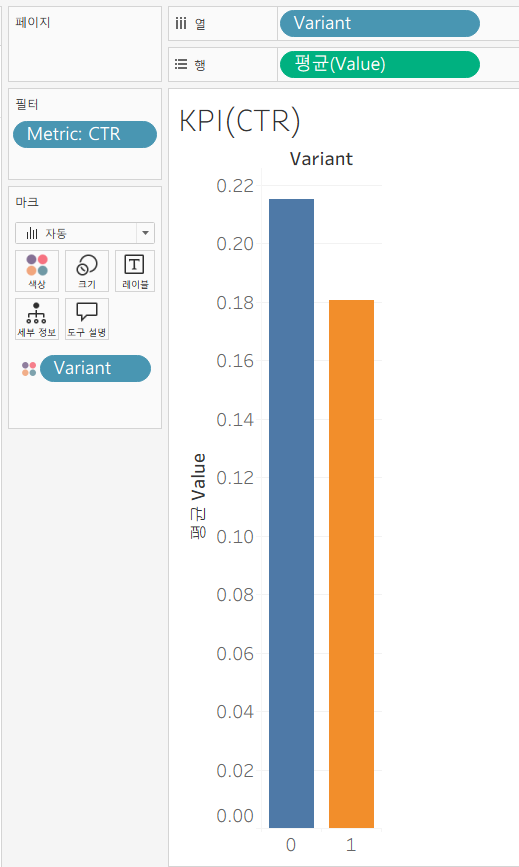
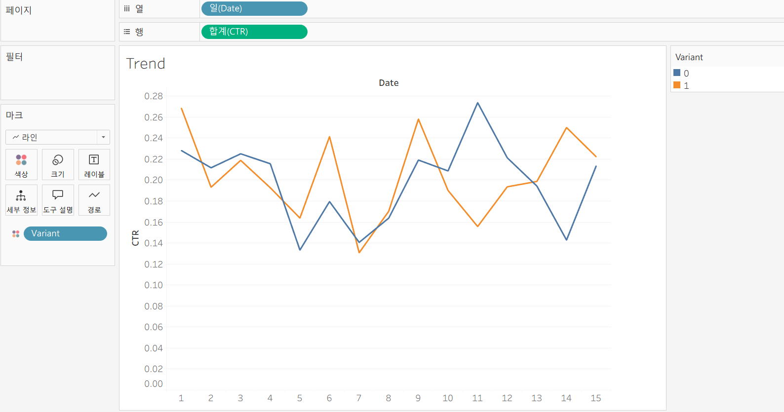
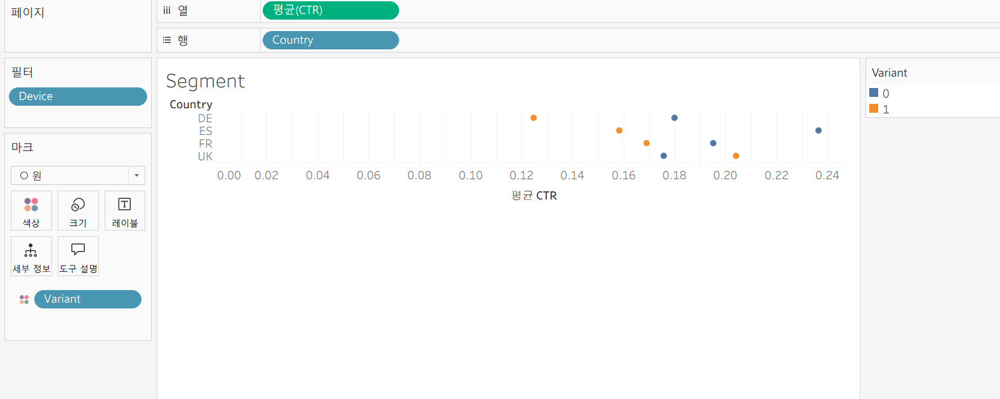

# A/B Test Tableau 대시보드 구현

---

## 1. 개요

A/B Test 결과를 Tableau로 시각화하여 KPI 비교, Trend 분석, Segment 분석을 수행한다.

---

## 2. 사용 데이터

- `ab_kpi_long.csv`
- `ab_segment_kpi.csv`
- `ab_daily_trend.csv`

---

## 3. 실습 가이드

### (1) 데이터 연결

> 시트 > 데이터 > 새 데이터 원본 > 텍스트 파일

- 3개 CSV 각각 추가
- 데이터는 서로 연결하지 않고 별도 사용

---

### (2) KPI 비교 (Bar Chart)

데이터: `ab_kpi_long.csv`

- Columns → `variant` (차원)
- Rows → `AVG(value)` (측정값)
- Color → `variant` (차원)
- Filter → `metric` (차원)

- metric: CTR
- 차트: Bar

---

### (3) Trend (Line Chart)

데이터: `ab_daily_trend.csv`

- Columns → `date` (차원, Day 또는 Exact Date)
- Rows → `AVG(CTR)` (측정값)
- Color → `variant` (차원)

- 차트: Line

---

### (4) Segment

데이터: `ab_segment_kpi.csv`

- Rows → `country` (차원)
- Columns → `AVG(CTR)` (측정값)
- Color → `variant` (차원)

- Filter → `device` (차원)
- 차트: 사각형

---

### (5) Dashboard

- KPI / Trend / Segment 시트 추가

---

### (6) 필터

- metric, country, device 추가
- Apply to Worksheets → 전체 적용

---

## 4. 주의사항

- `variant`는 반드시 차원(Dimension)으로 사용 (SUM 금지)
- CTR, Conversion, Value는 반드시 `AVG` 사용 (SUM 금지)
- date는 Year가 아닌 Day 또는 Exact Date 사용

---

## 5. 요구사항

- KPI 비교, Trend, Segment 포함
- 하나의 Dashboard 구성
- 필터 연동