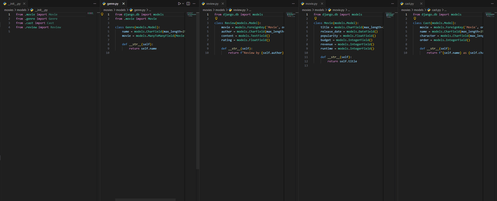
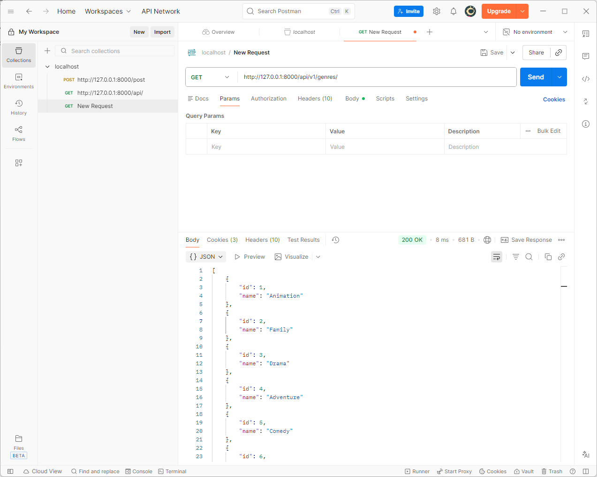
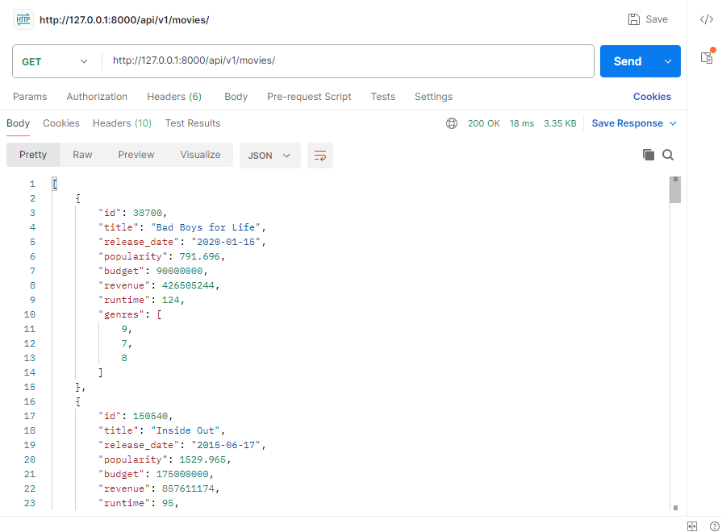
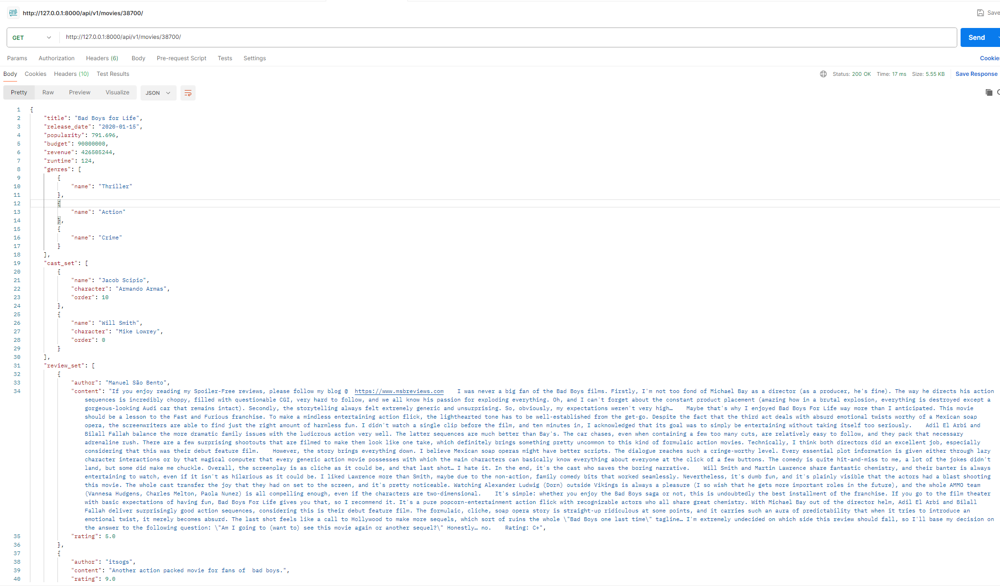
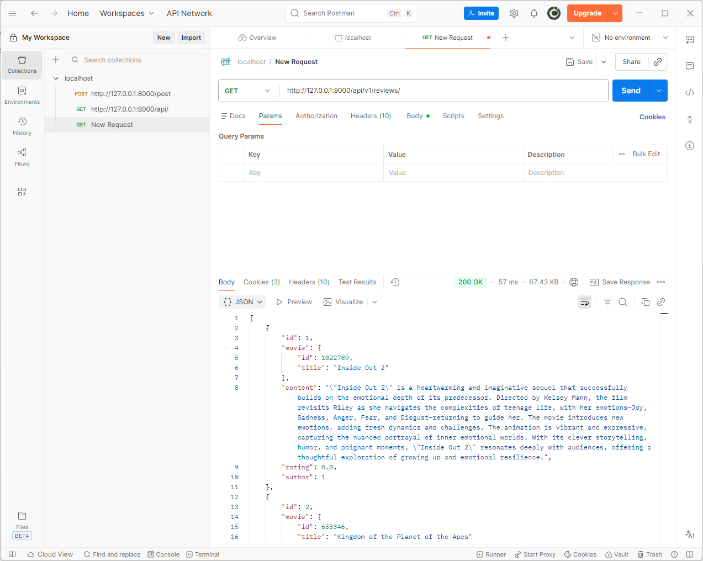
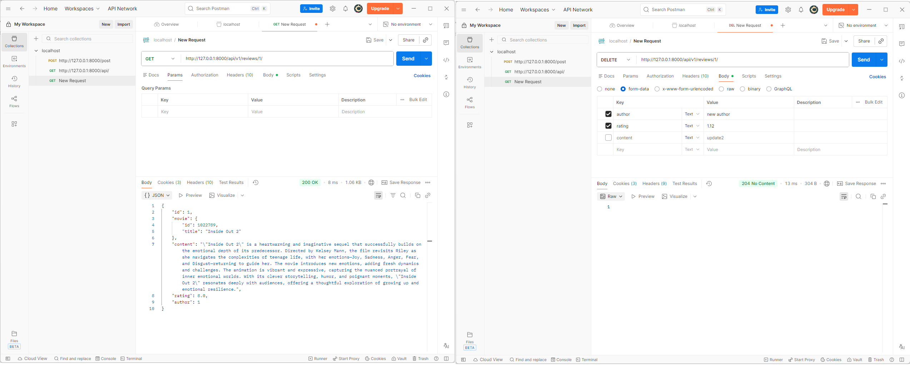
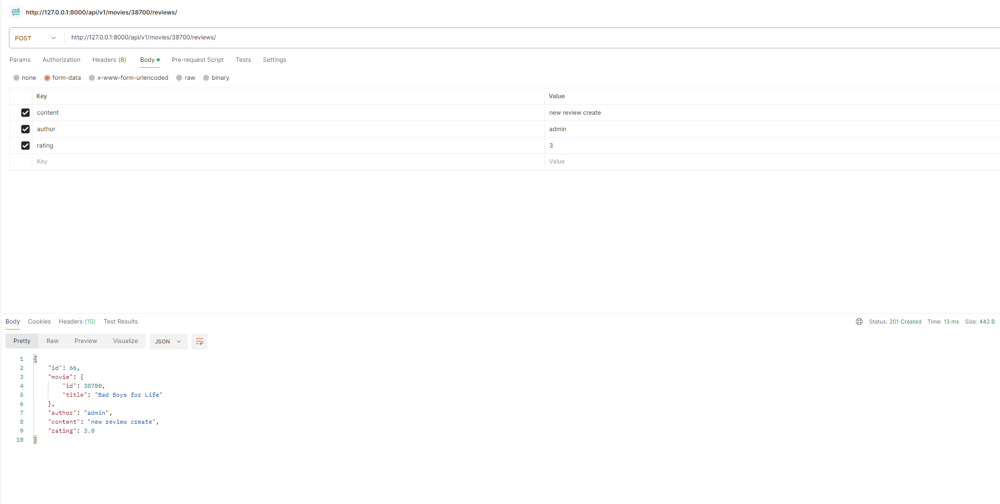
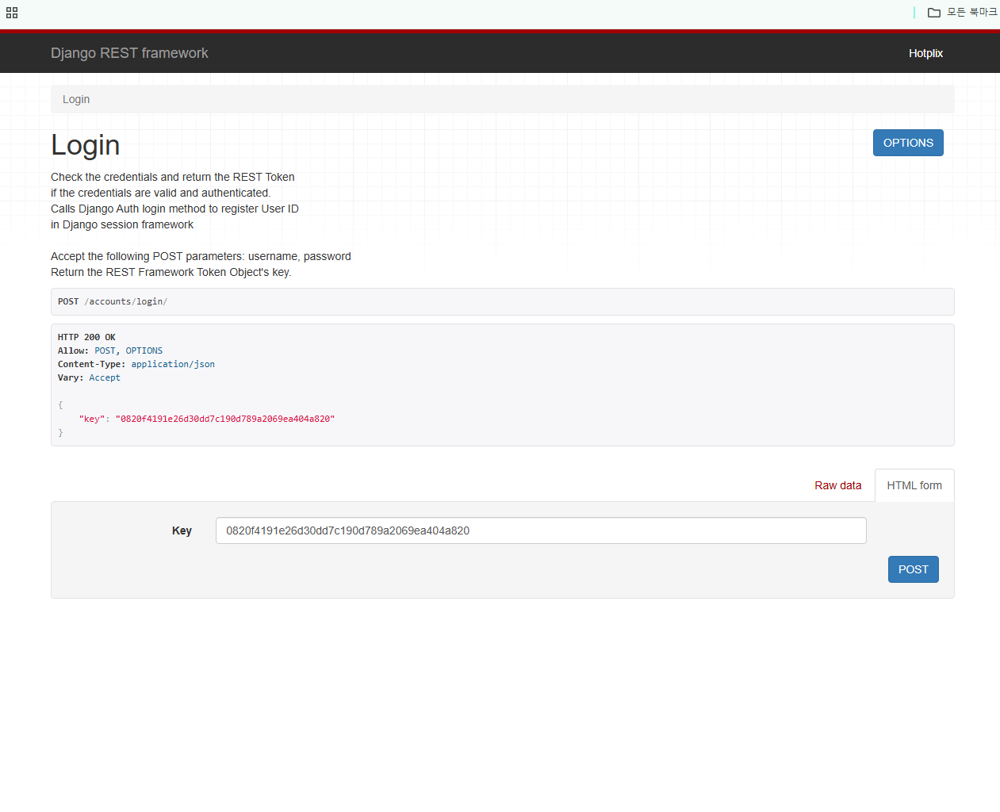
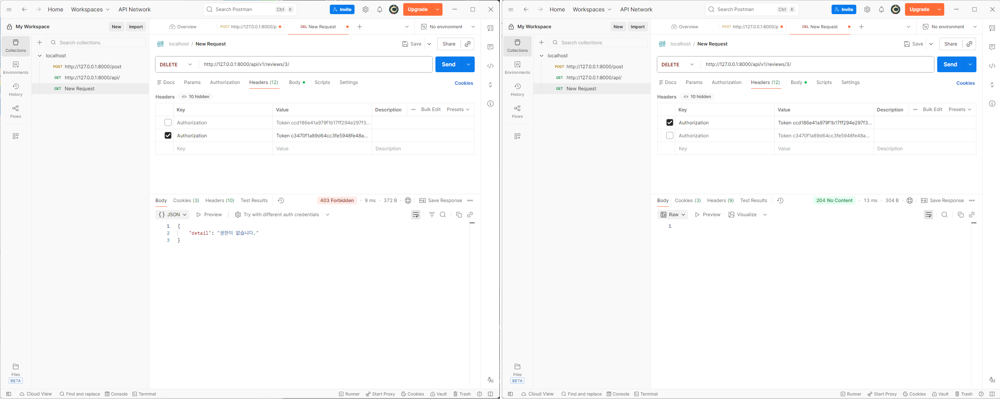
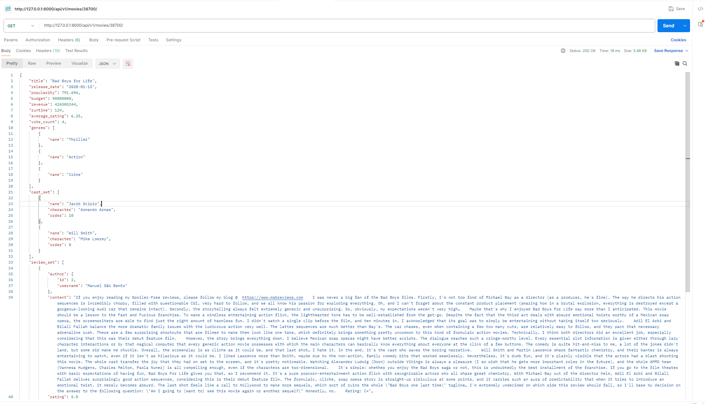

# 02-pjt

## 프로젝트 인원
- 김진광(1539411)
- 장우석(1539267)

## 프로젝트 소개
- 영화 추천 커뮤니티 서비스 개발 전, 서비스의 백엔트 API 서버를 구축하는 것을 목표로 함
- Django의 모델(Model) 기능을 활용하여 데이터베이스 스키마를 직접 설계하고, Django REST Framework(DRF)를 통해 클라이언트에게 데이터를 JSON 형식으로 제공하는 RESTful API를 구현해야 한다.

## Branch 구조
- master
- dev : master로 커밋 전 최종 검증
- feat : 각각의 problem 풀이 후 dev로 merge

## 프로젝트를 하며 학습한 내용
- 김진광 : csv 파일을 전처리 하는 방법과, 오늘 라이브 강의에서 배운 db에 적용하는 방법, django를 사용하여 기본적인 백엔드를 사용하는 방법에 대해 배웠다.
- 장우석 : csv 파일 전처리를 하고 django와 db를 연결시키는 방법을 학습했다. 또한 ORM 사용법 및 settings.py를 설정하는 방법에 대해 배웠다.

## 프로젝트를 하며 어려웠던 부분
- 김진광 : 아직 git에 익숙하지 않아, merge conflict가 발생했을 때의 대처방안이 어려웠다.
- 장우석 : User 모델이 `dj_rest_auth`에 의존하고 있어 모델 데이터를 수정할 때 User 더미 데이터를 넣는 데 어려움을 겪었다. 이를 해결하기 위해 fixture를 json dump를 이용해 임의로 만들었다. 이 때, 추가적인 오류가 발생했는데 처음 더미를 만들 때 password에 `!`를 넣어 처리했는데 실제 `dj_rest_auth`의 로그인 및 회원가입 기능은 password에 해시값을 저장하고 있기 때문에 추가적인 처리가 필요했다. 이를 위하여 `django.contrib.auth.hashers`의 `make_password`메서드를 활용했다.

## 새로 배운 점 및 느낀점
- 김진광 : DB를 처음부터 작업하며 어떤 방식으로 백엔드 프로그래밍을 구성하는지 알게 되었고, django를 사용하여 python으로도 충분히 작업할 수 있다는 것을 깨달았다.
- 장우석 : DB 설계가 프로젝트 중간에 바뀌었을 때 굉장히 곤란한 상황이 발생할 수 있음을 알게되었고, DB 설계를 가능하면 처음부터 수정사항이 없도록 해야될 것 같다. 물론 무조건 가능하지는 않겠지만 적어도 데이터를 보고 어떻게 전처리를 해서 db에 넣을지 충분한 고민이 필요할 것 같다.

## 프로젝트 실행 화면

### F01

### F02

### F03

### F04

### F05

### F06

### F07

### F08

### F09
