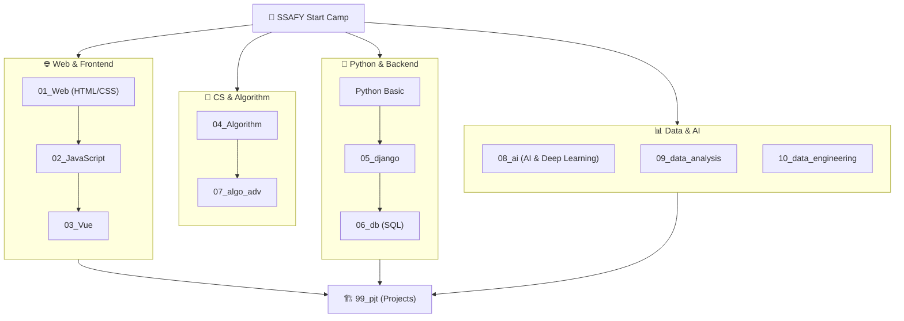

# 📚 Kim-jin-gwang's TIL (Today I Learned)

SSAFY(삼성 청년 SW 아카데미) 과정 동안 학습한 다양한 IT 기술과 문제 해결 과정을 기록하는 개인 학습 저장소입니다.  
웹 프론트엔드/백엔드부터 알고리즘, AI, 데이터 분석 및 엔지니어링까지 폭넓은 분야의 지식을 체계적으로 정리하고 있습니다.

---

## 🛠️ Tech Stack & Keywords

| 분류 | 기술 스택 |
| :--- | :--- |
| **Frontend** |     |
| **Backend & DB** |     |
| **Algorithm** |   (DFS, BFS, DP, Graph, Tree) |
| **AI & Data Science** |    (LLM, RAG, PEFT, EDA) |
| **Data Engineering** |     |

---

## 🗺️ Learning Roadmap

---

## 📂 Repository Structure & 학습 상세 내용

각 디렉터리는 핵심 IT 기술 스택에 맞춰 체계적으로 분류되어 있으며, 실습 과제 및 핵심 구현 코드를 담고 있습니다.

### 🌐 Web & Frontend

#### 01_Web - HTML5 & CSS3 기초
* **01-fundamentals-of-html-css**: 웹 표준을 준수하는 HTML 레이아웃 작성법 및 시맨틱 태그 학습
* **02-box-model**: 테두리(Border), 패딩(Padding), 마진(Margin) 구조 이해 및 텍스트 스타일링 실습
* **03-css-layout-position**: Flexbox 및 Grid 시스템, `position` 속성을 통한 반응형 레이아웃 배치 구현
* **실습 문제 (web_hw, web_ws 시리즈)**: 레이아웃 모형 설계 및 클론 코딩 실무 과제 해결

#### 02_JavaScript - 웹 동적 프로그래밍
* **01-basic-syntax-of-javascript**: 변수 스코프, 데이터 타입, 연산자 및 기본 제어문 실습
* **02-javascript-and-DOM**: 브라우저 API를 이용한 DOM 트리 탐색 및 동적 노드 조작 구현
* **03-functions & 05-object & 06-array**: 일급 객체로서의 함수, 화살표 함수, 구조 분해 할당, Spread 연산자 및 다양한 배열 메서드 실습
* **04-controlling-event**: 이벤트 리스너 등록, 버블링/캡처링 제어 및 폼 유효성 검사 실습
* **07-asynchronous-javascript**: Callbacks, Promises, 그리고 Async/Await를 이용한 비동기 작업 처리 및 API 데이터 통신 실습
* **실습 문제 (javascript_hw, javascript_ws 시리즈)**: 웹 페이지 동적 기능 제어 프로그래밍

#### 03_Vue - 모던 프론트엔드 프레임워크
* **01-introduction-of-vue**: Vue.js의 기본 개념, MVVM 패턴 및 반응성(Reactivity) 기초
* **02-single-file-component**: SFC(Single File Component) 설계와 모듈 단위 컴포넌트 개발
* **04-basic-syntax**: 디렉티브(`v-bind`, `v-model`, `v-on`, `v-for`, `v-if`) 활용 문법 실습
* **05-component-state-flow**: 부모-자식 간 `Props`와 `Emit`을 통한 단방향 데이터 흐름 구현
* **06_state_management**: Pinia를 이용한 글로벌 전역 상태 관리 및 모듈 단위 분할
* **07_vue_router**: 라우팅 시스템 구축 및 Navigation Guard 기반 사용자 인증 처리 실습

---

### 🎯 Python & Backend

#### 05_django - RESTful API & 웹 백엔드
* **01_webframework**: Django MTV 아키텍처 모델을 기반으로 한 웹 서버 구동 및 URLConf 매핑
* **02_Model_Serializer**: Django ORM을 통한 데이터 정의 및 ModelSerializer를 이용한 JSON REST API 인터페이스 설계
* **03_RelationShip**: 1:N(외래키), M:N(다대다) 관계 스키마 구축 및 ORM 쿼리 셋 작성
* **04_drf_auth**: Session/Cookie 및 Token 기반의 API 회원 인증 시스템(django-allauth, dj-rest-auth) 적용 실습

#### 06_db - 관계형 데이터베이스
* **01_Introduction_of_DataBase**: 관계형 데이터베이스의 특징, 무결성 제약 조건 및 정규화(1NF, 2NF, 3NF) 개념 학습
* **02_Baisc_SQL & 03_SQL_Advanced**: DDL, DML을 활용한 스키마 정의 및 복잡한 JOIN, GROUP BY, 서브쿼리, 트랜잭션 최적화 실습

---

### 🧮 Computer Science & Algorithm

#### 04_Algorithm - 알고리즘 문제 해결 전략
* **01_classes**: 알고리즘 시간/공간 복잡도 분석 및 기본적인 파이썬 OOP 구조 구현
* **02_list**: 1차원/2차원 배열 조작 및 델타 탐색(상하좌우), 투 포인터(Two Pointer) 기법
* **03_recursive & 04-perm_comb**: 재귀 함수의 호출 구조 이해 및 순열, 조합, 부분집합 구현 실습
* **05_stack_queue**: Stack, Queue, Deque 자료구조의 수동 구현 및 브래킷 매칭, DFS 탐색 응용
* **06_tree_graph**: Binary Tree 구현, 전위/중위/후위 순회 및 그래프의 인접 행렬/인접 리스트 표현법
* **07_DFS & 08-BFS**: Depth-First Search(깊이 우선 탐색)와 Breadth-First Search(너비 우선 탐색) 구현 및 미로 찾기, 최단 경로 탐색 문제 풀이
* **09-heap-backtracking**: 최소/최대 힙 구현 및 가지치기(Pruning)를 적용한 백트래킹(N-Queen 등) 구현
* **10-greedy**: 탐욕 알고리즘을 이용한 구간 스케줄링, 거스름돈 등 당장 최선인 해를 구하는 최적화 문제 해결
* **11-disjoint_set & 12-MST**: 서로소 집합 자료구조 구현, Kruskal 및 Prim 알고리즘을 이용한 최소 신장 트리(MST) 구성
* **13-shortestpath**: Dijkstra 및 Bellman-Ford, Floyd-Warshall 알고리즘을 통한 노드 간 최단 경로 탐색 실습
* **14-dp**: 메모이제이션(Memoization)과 타뷸레이션(Tabulation) 기법을 활용한 동적 계획법 문제 해결
* **15-sort**: Bubble, Selection, Insertion, Merge, Quick Sort 구현 및 특징 비교

#### 07_algo_adv - 고급 파이썬 및 자료 처리
* **02_regex_numpy**:
  * `01_regex`: 정규 표현식을 이용한 텍스트 데이터 파싱, 이메일/전화번호 등 패턴 매칭 실습
  * `02_numpy`: NumPy 라이브러리를 활용한 다차원 배열 연산(Vectorization) 성능 최적화
* **async & generator**: Generator, Iterator, Decorator 등의 효율적 메모리 관리 기법과 비동기(asyncio) 프로그래밍 기초 구현

---

### 🤖 Machine Learning & AI

#### 08_ai - 딥러닝 및 생성형 AI 응용
* **a_ AI를_위한_Python**: AI 개발을 위한 파이썬 환경 설정, 기초 제어 흐름 및 NumPy/Pandas 기본 활용법
* **b_AI_MATH**: 인공지능에 필요한 선형대수(행렬 곱, 고유값), 확률/통계(경사하강법, 오차함수)의 수학적 기초 학습
* **c_데이터_EDA_및_모델_학습**: 탐색적 데이터 분석(EDA) 기법과 간단한 선형 회귀, 로지스틱 회귀 모델 학습 파이프라인
* **d_MLP_구현**: 다층 퍼셉트론(MLP)의 순전파(Forward propagation) 및 역전파(Backpropagation) 엔진 직접 구현 및 활성화 함수 학습
* **e_CNN**: Convolutional Neural Network의 합성곱(Convolution) 및 풀링(Pooling) 연산 원리 이해와 이미지 분류 모델 구축
* **f_이미지_생성**: Diffusion 및 GAN 모델을 활용한 생성형 이미지 파이프라인 실습
* **g_토큰과_임베딩**: 텍스트 데이터 토큰화(Tokenization) 및 워드 임베딩(Word Embedding), 코사인 유사도 연산 실습
* **h_합성_데이터_제작**: LLM 기반의 질의 응답 데이터 또는 합성 텍스트(Synthetic Data) 자동 생성 기법 실습
* **ssafy_ai_2**:
  * `i_RAG`: 벡터 데이터베이스(ChromaDB 등)와 LLM API를 연동한 검색 증강 생성(Retrieval-Augmented Generation) 시스템 설계
  * `j_Agent`: 도구 사용(Tool Use/Function Calling) 및 자율적 판단 흐름을 갖춘 LangChain/LangGraph 에이전트 시스템 구현
  * `k_서비스_프로토타이핑`: AI 기능을 적용하여 웹 애플리케이션 프로토타입 개발 및 API 배포
  * `l_Quantization_and_TTP`: 모델 양자화(Int8, Int4) 및 추론 가속 기법 실습
  * `m_PEFT`: LoRA(Low-Rank Adaptation)를 통한 LLM 파인튜닝 실습 및 가중치 어댑터 추출

#### 09_data_analysis - 데이터 탐색 및 통계 분석
* **a_pandas**: Pandas 라이브러리를 활용한 데이터프레임 조작, 정제, 병합(Merge/Concat) 및 결측치 처리
* **b_statistics**: 기술통계, 가설 검정(t-test, Z-test), 신뢰 구간 분석 등 통계 기반 데이터 해석
* **c_abtest**: A/B 테스트의 실험 설계, 표본 크기 계산, 유의수준 검정 및 전환율 비교 기법 실습
* **d_visualization**: Matplotlib, Seaborn을 이용한 수치/범주형 데이터의 시각적 패턴 분석(Heatmap, Boxplot, Pairplot)
* **e_data_collection**: Beautiful Soup, Selenium을 활용한 웹 크롤링 및 REST API 데이터 수집
* **f_machine_learning**: Scikit-Learn을 이용한 지도/비지도 학습 모델링(의사결정나무, 랜덤포레스트, K-Means Clustering)
* **g_mlflow**: MLflow를 이용한 실험 파라미터 로깅, 메트릭 모니터링 및 모델 레지스트리 관리 실습

---

### ⚙️ Data Engineering

#### 10_data_engineering - 대규모 분산 데이터 처리
* **a_linux**: 리눅스 파일 시스템, 쉘 명령어, 퍼미션 제어 및 크론탭(Crontab)을 이용한 스케줄링 기초
* **b_docker**: Dockerfile 작성을 통한 애플리케이션 컨테이너 빌드 및 Docker Compose 기반의 다중 컨테이너 환경 구축
* **c_kafka & kafka-monitoring**: Apache Kafka 이벤트 스트리밍 토픽 설계, Producer/Consumer 작성 및 Prometheus/Grafana를 통한 카프카 브로커 모니터링 실습
* **d_flink & e_spark**: Apache Spark(PySpark) 및 Flink 엔진을 활용한 분산 배치 처리 및 실시간 윈도우 기반 스트림 로그 처리 실습
* **f_airflow**: Apache Airflow DAG 스케줄링 코드를 작성하여 멀티 태스크 데이터 파이프라인(ETL) 오케스트레이션 자동화
* **g_elastic**: ElasticSearch를 이용한 비정형 텍스트 인덱싱, 역색인 검색 쿼리 및 Kibana 시각화 대시보드 구축(ELK Stack)
* **h_hadoop**: HDFS(하둡 분산 파일 시스템) 입출력 및 MapReduce 분산 컴퓨팅의 개념적 원리 실습

---

### 🏗️ Projects & Evaluation
* **99_pjt - 관통 및 데이터 분석 프로젝트**
  * `01-pjt` ~ `03-pjt`: 백엔드(Django)와 프론트엔드(Vue.js) 기술을 연동한 웹 통합 애플리케이션 프로젝트
  * `ds_pjt`: 데이터 수집, 가공, 분석 모델 학습 및 비즈니스 인사이트 도출을 완료한 데이터 분석 특화 프로젝트
* **평가 대비 코드 (99_exam / exam_prac / 시험용코드)**: 알고리즘 역량 검정(A형 등) 및 월말 평가 대비 실습 문제 구현 코드 모음
